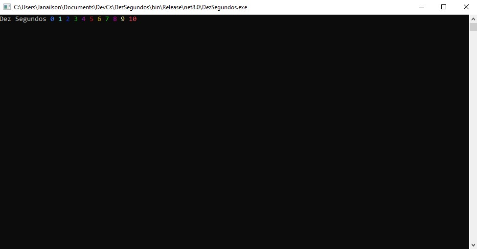

# DezSegundos
Este programa exibe uma contagem regressiva de 0 a 10 segundos
## Exemplo

```
Dez Segundos 0 1 2 3 4 5 6 7 8 9 10
```
## _Screenshot_



## Agradecimentos

-[Etec Adolpho Berezin](https://www.cps.sp.gov.br/etecs/etec-adolpho-berezin/)

-[Ermogenes Palacio](https://github.com/ermogenes) 

-[Diego Neri](https://github.com/diegoneri) 